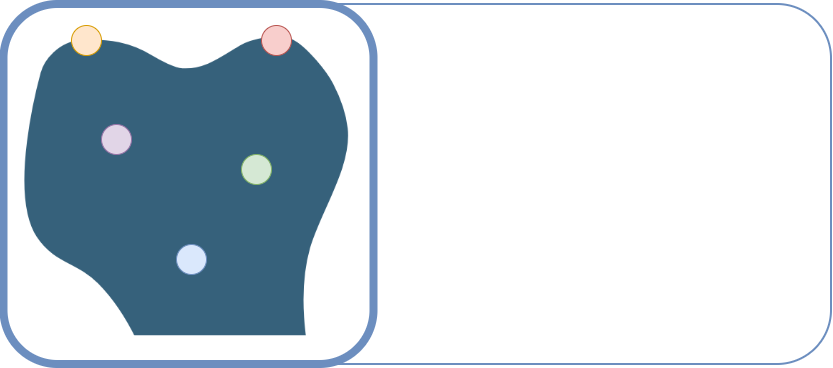

<p align="center">
  
</p>

**LmPT (LandmarkPointTransformer)** is a transformer-based framework built upon the [Pointcept](https://github.com/Pointcept/Pointcept) codebase, extending it with engines for anatomical landmark detection.  

This repository includes the methods as introduced in **LmPT: Conditional Point Transformer for Anatomical Landmark Detection on 3D Point Clouds** &rarr; [ [arXiv](https://www.arxiv.org/abs/2602.02808) ].

## Datasets
Available for download via [KeyboneNetCross](https://drive.google.com/drive/folders/1Vggo3RTWlzEmCd50pi6vApICekawpDeA?usp=drive_link).  
Place the content under the `data` directory.

### Dog Femur Dataset
This dataset includes 14 models of dog femurs from different breeds and sizes (7 left, 7 right) under `FBD`.  
With `mesh` and `pcds` representations, each model includes 11 anatomical landmark `annotations`.

Introduced in this work, shared under [](https://creativecommons.org/licenses/by-nc-sa/4.0/).

### Human Femur Dataset
This dataset includes 20 models of human femurs from different subjects (10 left, 10 right) under `FBH`.  
With `mesh` and `pcds` representations, each model includes 22 anatomical landmark `annotations`.

The representations are derived from the [VSDFullBodyBoneModels](https://github.com/RWTHmediTEC/VSDFullBodyBoneModels) dataset by RWTHmediTEC, shared under [](https://creativecommons.org/licenses/by-nc-sa/4.0/).


## Pre-trained model
A pre-trained, cross-species LmPT-v2 model is available for download via [LmPT-v2](https://drive.google.com/drive/folders/1IuwTHCS3cPyEMHf0-bHac9gJeQrvvKE8?usp=drive_link).  
Place the content under the `exp/keybonenetcross` directory.

## Quick Start

To clone LmPT with its adapted Pointcept submodule:
```bash
git clone --recursive https://github.com/Pierreoo/LandmarkPointTransformer.git
```

### Training

**Train from scratch** using a configuration file from `configs`, which will create an experiment folder in `exp` with training outputs.

```
sh Pointcept/scripts/train.sh -p ${INTERPRETER_PATH} -g ${NUM_GPU} -d ${DATASET_NAME} -c ${CONFIG_NAME} -n ${EXP_NAME}
```

For example:
```bash
sh Pointcept/scripts/train.sh -p python -g 1 -d keybonenetcross -c lfv2 -n scratch
```


### Testing

**Test a model** using the experiment name and corresponding config from a trained checkpoint.
```
sh Pointcept/scripts/test.sh -p ${INTERPRETER_PATH} -g ${NUM_GPU} -d ${DATASET_NAME} -n ${EXP_NAME} -w ${CHECKPOINT_NAME}
```

For example, to test the pre-trained LmPT-v2 model:
```bash
sh Pointcept/scripts/test.sh -p python -g 1 -d keybonenetcross -n lfv_cross -w model_best
```


## Licenses

[](LICENSE)
[](https://creativecommons.org/licenses/by-nc-sa/4.0/)


## Citation
If you find *LmPT* useful to your research, please consider citing:
```
@misc{bastico2026lmptconditionalpointtransformer,
      title={LmPT: Conditional Point Transformer for Anatomical Landmark Detection on 3D Point Clouds}, 
      author={Matteo Bastico and Pierre Onghena and David Ryckelynck and Beatriz Marcotegui and Santiago Velasco-Forero and Laurent Corté and Caroline Robine--Decourcelle and Etienne Decencière},
      year={2026},
      eprint={2602.02808},
      archivePrefix={arXiv},
      primaryClass={cs.CV},
      url={https://arxiv.org/abs/2602.02808}, 
}
```